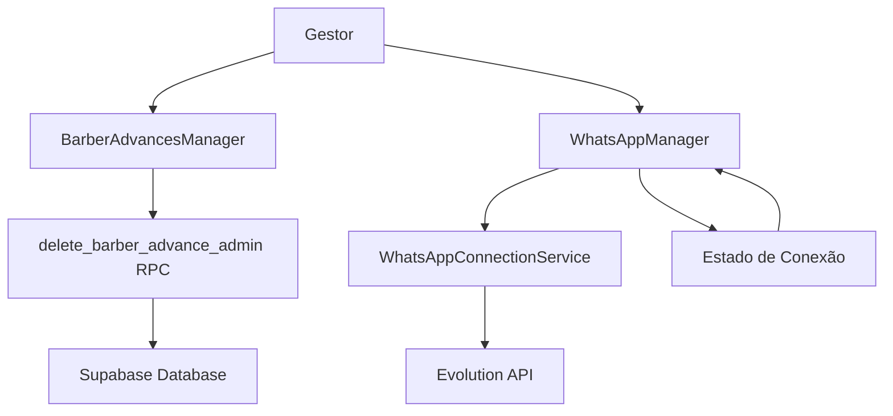

# Documento de Design

## Visão Geral

Este design aborda dois problemas críticos no sistema: a falha na remoção de vales devido a restrições de RLS (Row Level Security) e o comportamento inadequado de auto-relogin contínuo do WhatsApp. A solução envolve a criação de uma função RPC com SECURITY DEFINER para contornar o RLS de forma segura e a refatoração do componente WhatsAppManager para eliminar loops de reconexão.

## Arquitetura

### Componentes Principais

1. **BarberAdvancesManager** - Componente React para gestão de vales
2. **WhatsAppManager** - Componente React para gestão de conexão WhatsApp
3. **delete_barber_advance_admin** - Nova função RPC no Supabase
4. **WhatsAppConnectionService** - Novo serviço para gerenciar estado de conexão

### Fluxo de Dados



## Componentes e Interfaces

### 1. Função RPC para Remoção de Vales

**Localização**: Supabase Database Functions

```sql
CREATE OR REPLACE FUNCTION delete_barber_advance_admin(advance_id UUID)
RETURNS JSON
SECURITY DEFINER
LANGUAGE plpgsql
AS $$
DECLARE
    result JSON;
    user_role TEXT;
BEGIN
    -- Verificar se o usuário atual é gestor/admin
    SELECT role INTO user_role 
    FROM auth.users 
    WHERE id = auth.uid();
    
    IF user_role IS NULL OR user_role NOT IN ('admin', 'manager') THEN
        RETURN json_build_object(
            'success', false,
            'error', 'Acesso negado: usuário não tem permissões de administrador'
        );
    END IF;
    
    -- Verificar se o vale existe
    IF NOT EXISTS (SELECT 1 FROM barber_advances WHERE id = advance_id) THEN
        RETURN json_build_object(
            'success', false,
            'error', 'Vale não encontrado'
        );
    END IF;
    
    -- Remover o vale (SECURITY DEFINER permite contornar RLS)
    DELETE FROM barber_advances WHERE id = advance_id;
    
    RETURN json_build_object(
        'success', true,
        'message', 'Vale removido com sucesso',
        'advance_id', advance_id
    );
END;
$$;
```

### 2. Interface do Serviço de Conexão WhatsApp

```typescript
interface WhatsAppConnectionState {
  status: 'disconnected' | 'connecting' | 'connected' | 'error';
  message?: string;
  lastUpdate: Date;
}

interface WhatsAppConnectionService {
  getStatus(): Promise<WhatsAppConnectionState>;
  connect(): Promise<void>;
  disconnect(): Promise<void>;
  onStatusChange(callback: (state: WhatsAppConnectionState) => void): () => void;
}
```

### 3. Componente BarberAdvancesManager Refatorado

```typescript
interface BarberAdvancesManagerProps {
  advances: BarberAdvance[];
  onAdvanceRemoved: (advanceId: string) => void;
}

interface BarberAdvance {
  id: string;
  amount: number;
  barber_id: string;
  created_at: string;
}
```

### 4. Componente WhatsAppManager Refatorado

```typescript
interface WhatsAppManagerProps {
  initialStatus?: WhatsAppConnectionState;
}

interface WhatsAppManagerState {
  connectionState: WhatsAppConnectionState;
  isLoading: boolean;
  error: string | null;
}
```

## Modelos de Dados

### Estado de Conexão WhatsApp

```typescript
type ConnectionStatus = 'disconnected' | 'connecting' | 'connected' | 'error';

interface WhatsAppConnectionState {
  status: ConnectionStatus;
  message?: string;
  lastUpdate: Date;
  instanceId?: string;
}
```

### Resposta da Função RPC

```typescript
interface RPCResponse {
  success: boolean;
  message?: string;
  error?: string;
  advance_id?: string;
}
```

## Propriedades de Correção

*Uma propriedade é uma característica ou comportamento que deve ser verdadeiro em todas as execuções válidas de um sistema - essencialmente, uma declaração formal sobre o que o sistema deve fazer. As propriedades servem como ponte entre especificações legíveis por humanos e garantias de correção verificáveis por máquina.*

Agora vou usar a ferramenta de prework para analisar os critérios de aceitação antes de escrever as propriedades de correção.

### Propriedades de Remoção de Vales

**Propriedade 1: Remoção bem-sucedida de vales**
*Para qualquer* vale existente e gestor autorizado, quando a remoção é solicitada, o vale deve ser removido da base de dados e a interface deve ser atualizada imediatamente
**Valida: Requisitos 1.1, 1.3**

**Propriedade 2: Bloqueio de usuários não autorizados**
*Para qualquer* usuário sem permissões de gestor, tentativas de remoção de vales devem ser bloqueadas com mensagem de erro "Acesso negado"
**Valida: Requisitos 1.5, 4.4**

**Propriedade 3: Tratamento de vales inexistentes**
*Para qualquer* ID de vale que não existe na base de dados, a função RPC deve retornar erro específico "Vale não encontrado"
**Valida: Requisitos 4.3**

**Propriedade 4: Resposta de confirmação**
*Para qualquer* remoção bem-sucedida, o sistema deve retornar confirmação contendo o ID do vale removido
**Valida: Requisitos 4.5**

**Propriedade 5: Exibição de erros de remoção**
*Para qualquer* falha na remoção de vale, o sistema deve exibir mensagem de erro clara e específica
**Valida: Requisitos 1.4**

### Propriedades de Controle de Conexão WhatsApp

**Propriedade 6: Parada de processos automáticos quando conectado**
*Para qualquer* conexão WhatsApp estabelecida, todos os timers, polling automático e processos de reconexão devem ser interrompidos
**Valida: Requisitos 2.2, 2.3, 5.1**

**Propriedade 7: Estabilidade de conexão estabelecida**
*Para qualquer* conexão WhatsApp estabelecida, o sistema deve manter o status sem tentar reconectar automaticamente
**Valida: Requisitos 2.4**

**Propriedade 8: Controle manual de erros**
*Para qualquer* erro de conexão WhatsApp, o sistema deve informar o erro mas aguardar ação manual ao invés de tentar reconectar automaticamente
**Valida: Requisitos 2.5, 5.4**

**Propriedade 9: Reatividade da interface**
*Para qualquer* mudança de status de conexão WhatsApp, a interface deve ser atualizada imediatamente refletindo o novo estado
**Valida: Requisitos 3.4**

**Propriedade 10: Limpeza de recursos React**
*Para qualquer* componente WhatsAppManager, quando há múltiplos useEffect ou quando o componente é desmontado, todos os timers e listeners anteriores devem ser limpos antes de iniciar novos
**Valida: Requisitos 5.2, 5.3**

**Propriedade 11: Persistência de estado durante navegação**
*Para qualquer* navegação entre páginas, o status da conexão WhatsApp deve ser mantido sem reiniciar processos automáticos
**Valida: Requisitos 5.5**

## Tratamento de Erros

### Cenários de Erro para Remoção de Vales

1. **Vale não encontrado**: Retorna erro específico com código HTTP 404
2. **Usuário não autorizado**: Retorna erro de acesso negado com código HTTP 403
3. **Erro de base de dados**: Retorna erro genérico com código HTTP 500
4. **ID inválido**: Retorna erro de validação com código HTTP 400

### Cenários de Erro para WhatsApp

1. **Falha de conexão**: Exibe status "Erro" com mensagem específica
2. **Timeout de conexão**: Exibe erro de timeout sem tentar reconectar
3. **API indisponível**: Exibe erro de serviço indisponível
4. **Instância não encontrada**: Exibe erro de configuração

### Estratégias de Recuperação

- **Remoção de vales**: Permitir nova tentativa manual após correção de permissões
- **WhatsApp**: Permitir apenas reconexão manual através de botão específico
- **Limpeza de recursos**: Garantir cleanup automático em todos os cenários de erro

## Estratégia de Testes

### Abordagem Dual de Testes

O sistema utilizará tanto testes unitários quanto testes baseados em propriedades para garantir cobertura abrangente:

- **Testes unitários**: Verificam exemplos específicos, casos extremos e condições de erro
- **Testes de propriedade**: Verificam propriedades universais através de múltiplas entradas

### Configuração de Testes de Propriedade

- **Biblioteca**: fast-check para TypeScript/JavaScript
- **Iterações mínimas**: 100 por teste de propriedade
- **Formato de tag**: **Feature: critical-fixes, Property {número}: {texto da propriedade}**

### Foco dos Testes Unitários

- Exemplos específicos de estados de UI (conectado, desconectado, erro)
- Casos extremos de validação de entrada
- Integração entre componentes React e serviços
- Condições de erro específicas

### Foco dos Testes de Propriedade

- Comportamento universal de remoção de vales
- Propriedades de limpeza de recursos React
- Estabilidade de conexão WhatsApp
- Controle de acesso e autorização

### Testes de Integração

- Fluxo completo de remoção de vale (UI → RPC → Database)
- Ciclo de vida completo de conexão WhatsApp
- Navegação entre páginas mantendo estado
- Cleanup de recursos durante desmontagem de componentes