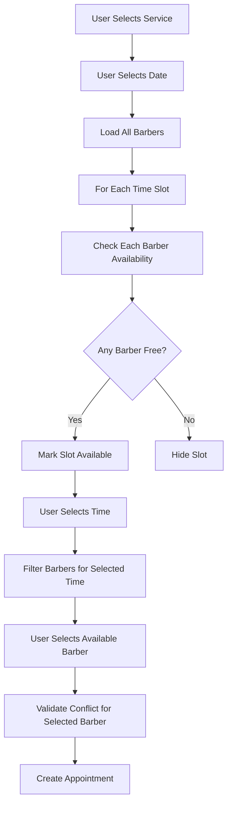

# Design Document: Disponibilidade Individual de Barbeiros

## Overview

This design document outlines the implementation of individual barber availability for the booking system. Currently, the system blocks entire time slots when any barber has an appointment, preventing clients from booking with other available barbers. This design transforms the system to check availability per barber, showing time slots as available when at least one barber is free, and filtering barber lists based on individual schedules.

### Current System Behavior

The existing implementation in `src/components/Booking.tsx` follows this flow:
1. User selects service → barber → date/time
2. `getTimeSlotsForDate()` generates slots based on barbershop operating hours
3. `getAvailableSlotsForDate()` filters slots by checking if the **selected barber** has conflicts
4. `isTimeConflict()` checks if a time overlaps with existing appointments for **one barber**

**Problem**: When checking availability, the system only considers the currently selected barber. However, the UX flow requires selecting a barber before seeing time slots, which means users can't see all available times across all barbers.

### Proposed System Behavior

The new implementation will:
1. User selects service → date/time → barber (reordered flow)
2. `getTimeSlotsForDate()` generates slots based on barbershop operating hours (unchanged)
3. `getAvailableSlotsForDate()` checks **all barbers** and marks slot available if **any barber** is free
4. `getAvailableBarbersForSlot()` returns list of available barbers for a specific time slot
5. When user selects time, show only available barbers for that slot
6. `isTimeConflict()` validates conflicts only for the **selected barber** during booking

## Architecture

### Component Structure

```
Booking Component (Modified)
├── Service Selection (unchanged)
├── Date/Time Selection (new: moved before barber selection)
│   ├── getAvailableSlotsForDate() - checks all barbers
│   └── Display slots with availability count
├── Barber Selection (new: moved after time selection)
│   └── getAvailableBarbersForSlot() - filter by selected time
└── Confirmation (unchanged)
```

### Data Flow



## Components and Interfaces

### Modified Functions

#### 1. `getAvailableSlotsForDate()`

**Current Signature**:
```typescript
const getAvailableSlotsForDate = async () => {
  // Checks only formData.barber
  // Returns string[]
}
```

**New Signature**:
```typescript
const getAvailableSlotsForDate = async (
  date: string,
  serviceId: string
): Promise<SlotAvailability[]>

interface SlotAvailability {
  time: string;
  availableBarberIds: string[];
  availableCount: number;
}
```

**New Logic**:
1. Get all visible barbers from database
2. For each barber, check availability on selected date (respect barber's weekly schedule)
3. For each time slot in operating hours:
   - Query appointments for ALL barbers at that time
   - Query breaks for ALL barbers at that time
   - For each barber:
     - Check if barber is available on this day of week
     - Check if time conflicts with barber's appointments (considering service duration)
     - Check if time overlaps with barber's breaks
   - If at least one barber is free, include slot with list of available barber IDs
4. Return array of SlotAvailability objects

**Performance Optimization**:
- Use parallel queries: `Promise.all()` to fetch appointments and breaks for all barbers simultaneously
- Cache barber list during component lifecycle
- Use single query with `IN` clause for multiple barber IDs

#### 2. `getAvailableBarbersForSlot()` (New Function)

**Signature**:
```typescript
const getAvailableBarbersForSlot = async (
  date: string,
  time: string,
  serviceId: string
): Promise<BarberAvailability[]>

interface BarberAvailability {
  barber: Barber;
  isAvailable: boolean;
  reason?: 'appointment' | 'break' | 'closed';
}
```

**Logic**:
1. Get all visible barbers
2. Get service duration from serviceId
3. Calculate end time: startTime + duration
4. For each barber:
   - Check if barber works on this day of week
   - Query appointments for this barber at this time
   - Query breaks for this barber at this time
   - Check if time range conflicts with appointments or breaks
5. Return array with availability status for each barber

#### 3. `isTimeConflict()` (Modified)

**Current Signature**:
```typescript
const isTimeConflict = (
  newTime: string,
  duration: number,
  existingAppointments: any[],
  selectedService: any
) => boolean
```

**Changes**:
- No signature change needed
- Already checks conflicts for a specific barber's appointments
- Ensure it's called with appointments filtered by barberId

### New State Management

```typescript
// Add new state for slot availability metadata
const [slotsWithAvailability, setSlotsWithAvailability] = useState<SlotAvailability[]>([]);

// Modify existing state
const [availableSlots, setAvailableSlots] = useState<string[]>([]); // Keep for backward compatibility

// Add state for barber filtering
const [availableBarbersForSelectedTime, setAvailableBarbersForSelectedTime] = useState<Barber[]>([]);
```

### Modified User Flow

**Step Order Change**:
```typescript
// OLD: "service" → "barber" → "time" → "form" → "success"
// NEW: "service" → "time" → "barber" → "form" → "success"

const [step, setStep] = useState<"service" | "time" | "barber" | "form" | "success">("service");
```

**Step Transitions**:
1. **Service Selection**: User selects service → `setStep("time")`
2. **Time Selection**: 
   - Load available slots (checking all barbers)
   - Display slots with availability count
   - User selects time → `setStep("barber")`
3. **Barber Selection**:
   - Filter barbers by selected time
   - User selects barber → `setStep("form")`
4. **Form Confirmation**: User confirms → create appointment

## Data Models

### Database Schema (No Changes Required)

The existing schema already supports per-barber availability:

```sql
-- appointments table
CREATE TABLE appointments (
  id UUID PRIMARY KEY,
  barber_id UUID REFERENCES barbers(id),  -- Individual barber
  appointment_date DATE,
  appointment_time TIME,
  service_id UUID REFERENCES services(id),
  -- ... other fields
);

-- barber_breaks table
CREATE TABLE barber_breaks (
  id UUID PRIMARY KEY,
  barber_id UUID REFERENCES barbers(id),  -- Individual barber
  date DATE,
  start_time TIME,
  end_time TIME
);

-- barbers table
CREATE TABLE barbers (
  id UUID PRIMARY KEY,
  availability JSONB,  -- Weekly schedule per barber
  -- ... other fields
);
```

### TypeScript Interfaces

```typescript
interface SlotAvailability {
  time: string;                    // "14:00"
  availableBarberIds: string[];    // ["uuid1", "uuid2"]
  availableCount: number;          // 2
}

interface BarberWithAvailability {
  id: string;
  name: string;
  specialty: string;
  image_url: string;
  rating: number;
  availability: BarberAvailability;
  isAvailableForSlot: boolean;
  unavailableReason?: 'appointment' | 'break' | 'day_off';
}

interface TimeSlotDisplay {
  time: string;
  availableCount: number;
  isAvailable: boolean;
}
```

## Correctness Properties

*A property is a characteristic or behavior that should hold true across all valid executions of a system—essentially, a formal statement about what the system should do. Properties serve as the bridge between human-readable specifications and machine-verifiable correctness guarantees.*

### Property Reflection

After analyzing the acceptance criteria, I identified the following redundancies:

**Redundant Properties Eliminated**:
- Criteria 1.2 (hide slot if all busy) is the logical inverse of 1.1 (show if any free) - testing 1.1 covers both
- Criteria 2.2 (hide unavailable barbers) is the same as 2.1 (show only available) - testing 2.1 covers both
- Criteria 3.2 (allow simultaneous bookings) is the inverse of 3.1 (per-barber conflicts) - testing 3.1 covers both
- Criteria 3.3 (service duration in conflicts) duplicates 1.3 (service duration in availability) - same logic
- Criteria 3.4 (breaks in conflicts) duplicates 1.4 (breaks in availability) - same logic

**Remaining Unique Properties**: 6 properties that each validate distinct correctness guarantees

### Property 1: Slot Availability with Partial Barber Availability

*For any* time slot and set of barbers, if at least one barber has no appointment conflict and no break conflict at that time, then the slot should be marked as available.

**Validates: Requirements 1.1**

### Property 2: Service Duration Conflict Detection

*For any* service with duration D minutes, appointment at time T, and new booking attempt at time T', the system should detect a conflict if and only if the time ranges [T, T+D) and [T', T'+D') overlap.

**Validates: Requirements 1.3**

### Property 3: Break Period Exclusion

*For any* barber with a break from time B_start to B_end, and service with duration D, a time slot T should be unavailable for that barber if the service period [T, T+D) overlaps with the break period [B_start, B_end).

**Validates: Requirements 1.4**

### Property 4: Barber Filtering by Time Slot

*For any* selected time slot T and service with duration D, the list of available barbers should contain exactly those barbers who have no appointment conflicts and no break conflicts during the period [T, T+D).

**Validates: Requirements 2.1**

### Property 5: Barber Deselection on Unavailability

*For any* booking state where a barber B is selected for time T1, if the user changes to time T2 where barber B is unavailable, then the barber selection should be cleared.

**Validates: Requirements 2.3**

### Property 6: Available Barber Count Accuracy

*For any* time slot, the displayed count of available barbers should equal the number of barbers who have no conflicts (appointments or breaks) during that time period.

**Validates: Requirements 2.4**

### Property 7: Per-Barber Conflict Isolation

*For any* two different barbers B1 and B2, an appointment for B1 at time T should not prevent booking B2 at the same time T, provided B2 has no other conflicts.

**Validates: Requirements 3.1**

## Error Handling

### Validation Errors

1. **No Barbers Available**: If all barbers are unavailable for a selected time
   - Clear time selection
   - Show message: "Nenhum barbeiro disponível neste horário. Por favor, escolha outro horário."
   - Keep user on time selection step

2. **Selected Barber Becomes Unavailable**: If user changes time and selected barber is no longer available
   - Clear barber selection
   - Show message: "O barbeiro selecionado não está disponível neste horário. Por favor, escolha outro barbeiro."
   - Move to barber selection step with filtered list

3. **Concurrent Booking Conflict**: If another user books the same barber/time while current user is filling form
   - Show error toast: "Este horário foi reservado por outro cliente. Por favor, escolha outro horário."
   - Return to time selection step
   - Refresh available slots

### Database Query Errors

1. **Failed to Load Barbers**: 
   - Log error to console
   - Show toast: "Erro ao carregar barbeiros. Tente recarregar a página."
   - Disable booking flow

2. **Failed to Load Appointments**:
   - Log error to console
   - Assume all slots are unavailable (fail-safe)
   - Show toast: "Erro ao verificar disponibilidade. Tente novamente."

3. **Failed to Load Breaks**:
   - Log warning to console
   - Continue without break data (breaks table might not exist)
   - Ignore 404/PGRST116 errors (table not found)

### Edge Cases

1. **Barber Removed During Booking**: If a barber is deleted/hidden while user is booking
   - Validate barber still exists before creating appointment
   - If not, show error and return to barber selection

2. **Operating Hours Changed**: If admin changes operating hours during booking
   - Realtime subscription updates available slots
   - If selected time becomes invalid, clear selection and show message

3. **Service Duration Changed**: If admin changes service duration during booking
   - Recalculate conflicts with new duration
   - May cause previously available slots to become unavailable

## Testing Strategy

### Dual Testing Approach

This feature requires both unit tests and property-based tests for comprehensive coverage:

- **Unit tests**: Verify specific examples, edge cases, and error conditions
- **Property tests**: Verify universal properties across all inputs
- Both are complementary and necessary

### Unit Testing

Focus on specific scenarios and edge cases:

1. **Specific Time Conflict Scenarios**:
   - Test exact overlap: appointment 14:00-14:30, new booking 14:00-14:30
   - Test partial overlap: appointment 14:00-14:30, new booking 14:15-14:45
   - Test no overlap: appointment 14:00-14:30, new booking 14:30-15:00

2. **Break Overlap Scenarios**:
   - Break 12:00-13:00, service 30min, slot 12:30 (should conflict)
   - Break 12:00-13:00, service 30min, slot 11:30 (should conflict)
   - Break 12:00-13:00, service 30min, slot 13:00 (should not conflict)

3. **Multi-Barber Scenarios**:
   - 3 barbers, 1 busy, 2 free → slot available
   - 3 barbers, 2 busy, 1 free → slot available
   - 3 barbers, 3 busy → slot unavailable

4. **State Management**:
   - Barber selected, time changed to unavailable slot → barber cleared
   - Barber selected, time changed to available slot → barber kept

5. **Integration Tests**:
   - Full booking flow: service → time → barber → confirm
   - Concurrent booking conflict handling
   - Realtime updates when appointments change

### Property-Based Testing

Use a property-based testing library (e.g., fast-check for TypeScript) to verify universal properties:

**Configuration**: Minimum 100 iterations per property test

**Property Test 1: Slot Availability with Partial Barber Availability**
```typescript
// Feature: disponibilidade-individual-barbeiros, Property 1: Slot Availability with Partial Barber Availability
// For any time slot and set of barbers, if at least one barber has no conflicts, slot is available
```

**Property Test 2: Service Duration Conflict Detection**
```typescript
// Feature: disponibilidade-individual-barbeiros, Property 2: Service Duration Conflict Detection
// For any two time ranges, conflict detection should match mathematical overlap definition
```

**Property Test 3: Break Period Exclusion**
```typescript
// Feature: disponibilidade-individual-barbeiros, Property 3: Break Period Exclusion
// For any break period and service duration, overlap detection should be accurate
```

**Property Test 4: Barber Filtering by Time Slot**
```typescript
// Feature: disponibilidade-individual-barbeiros, Property 4: Barber Filtering by Time Slot
// For any time slot, filtered barbers should exactly match those without conflicts
```

**Property Test 5: Barber Deselection on Unavailability**
```typescript
// Feature: disponibilidade-individual-barbeiros, Property 5: Barber Deselection on Unavailability
// For any barber selection and time change, selection cleared if barber unavailable at new time
```

**Property Test 6: Available Barber Count Accuracy**
```typescript
// Feature: disponibilidade-individual-barbeiros, Property 6: Available Barber Count Accuracy
// For any time slot, displayed count should equal actual number of available barbers
```

**Property Test 7: Per-Barber Conflict Isolation**
```typescript
// Feature: disponibilidade-individual-barbeiros, Property 7: Per-Barber Conflict Isolation
// For any two different barbers, one's appointment should not block the other's availability
```

### Test Data Generation

For property-based tests, generate:
- Random time slots (09:00-20:00 in 30min increments)
- Random service durations (15, 30, 45, 60 minutes)
- Random appointment schedules for multiple barbers
- Random break periods
- Random barber weekly availability schedules

### Performance Testing

1. **Load Test**: Measure performance with realistic data
   - 3 barbers
   - 30 time slots per day
   - 10-20 existing appointments per day
   - 5-10 breaks per day
   - Target: < 500ms to load available slots

2. **Concurrent Booking Test**: Simulate multiple users booking simultaneously
   - Verify conflict detection works correctly
   - Verify no double-bookings occur

## Implementation Notes

### Performance Optimizations

1. **Parallel Queries**: Use `Promise.all()` to fetch data for all barbers simultaneously
   ```typescript
   const barberIds = barbers.map(b => b.id);
   const [appointmentsData, breaksData] = await Promise.all([
     supabase.from('appointments')
       .select('*')
       .in('barber_id', barberIds)
       .eq('appointment_date', date),
     supabase.from('barber_breaks')
       .select('*')
       .in('barber_id', barberIds)
       .eq('date', date)
   ]);
   ```

2. **Memoization**: Cache barber list during component lifecycle
   ```typescript
   const barbersRef = useRef<Barber[]>([]);
   ```

3. **Debouncing**: Debounce realtime updates to avoid excessive recalculations
   ```typescript
   const debouncedLoadSlots = useMemo(
     () => debounce(loadAvailableSlots, 500),
     []
   );
   ```

### Backward Compatibility

1. **Existing Appointments**: No migration needed - existing appointments already have barber_id
2. **Barber Availability**: If barber.availability is null, assume available all days (default behavior)
3. **Breaks Table**: Handle case where barber_breaks table doesn't exist (ignore 404 errors)

### Realtime Updates

Maintain existing realtime subscription but update the filter:
```typescript
supabase
  .channel('booking-appointments')
  .on('postgres_changes', {
    event: '*',
    schema: 'public',
    table: 'appointments',
    // Remove barber_id filter to listen for all barbers
  }, () => {
    debouncedLoadSlots();
  })
  .subscribe();
```

### UI/UX Considerations

1. **Availability Indicator**: Show count of available barbers per slot
   ```tsx
   <div className="text-xs text-muted-foreground">
     {slot.availableCount} {slot.availableCount === 1 ? 'barbeiro' : 'barbeiros'} disponível
   </div>
   ```

2. **Barber Filtering**: When showing barbers after time selection, visually indicate why some are hidden
   ```tsx
   {availableBarbersForSelectedTime.length === 0 && (
     <p>Nenhum barbeiro disponível neste horário. Escolha outro horário.</p>
   )}
   ```

3. **Loading States**: Show loading indicators during availability checks
   ```tsx
   {loadingSlots && <Spinner />}
   ```

4. **Empty States**: Handle case where no slots are available
   ```tsx
   {availableSlots.length === 0 && (
     <p>Nenhum horário disponível. Tente outra data.</p>
   )}
   ```

## Migration Path

### Phase 1: Add New Functions (Non-Breaking)
- Implement `getAvailableSlotsForDate()` with new signature
- Implement `getAvailableBarbersForSlot()`
- Add new state variables
- Keep existing flow working

### Phase 2: Update UI Flow (Breaking)
- Change step order: service → time → barber
- Update step transitions
- Update UI components for each step
- Test thoroughly in development

### Phase 3: Deploy and Monitor
- Deploy to production
- Monitor for errors and performance issues
- Gather user feedback
- Iterate on UX improvements

## Success Metrics

1. **Increased Bookings**: More appointments created due to increased availability visibility
2. **Reduced Blocked Slots**: Fewer time slots showing as unavailable
3. **Better Barber Distribution**: More even distribution of appointments across barbers
4. **User Satisfaction**: Positive feedback about finding available times
5. **Performance**: Slot loading time remains under 500ms

## Future Enhancements

1. **Smart Barber Suggestions**: Recommend barbers based on availability and user preferences
2. **Waitlist Feature**: Allow users to join waitlist for fully booked slots
3. **Barber Preferences**: Let users save favorite barbers
4. **Availability Heatmap**: Show visual calendar with availability density
5. **Multi-Service Booking**: Allow booking multiple services in sequence
